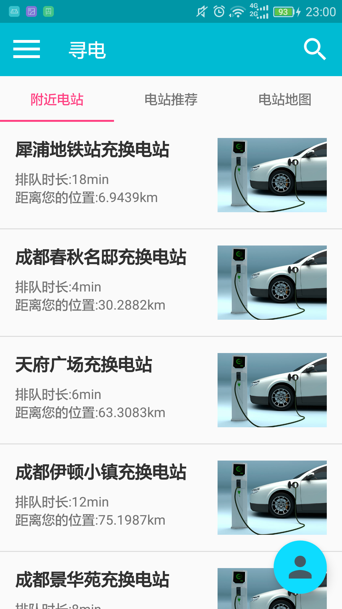

# 此项目作为APP的服务器
## 说明
- 为寻电APP提供服务
- 
- 
- 基本上仅通过IP+servlet访问本服务器
- 仅在本地使用时，IP为http://192.168.0.8:8080
- 公网IP为118.24.0.184，项目文件名BatteryServet，使用腾讯云服务器，最低配置+2Mbps带宽，系统为Windows 2012 Server，节点位于成都

## 更新记录
### 1月31日更新
- 创建数据库，预先添加了示例数据，数据库文件已上传，详情请阅/data/README.md
- 创建与数据库对应的描述各实体的类
- 创建ConnectServlet用来测试服务器与APP的连接

### 2月2日更新
- 通过数据库查询，实现了响应APP的登录、获取车辆和电站信息的请求
- 使用GSON向APP反馈数据
- 引入的经纬测距算法目前正在试用，有待检验

### 2月3日更新
- 数据库station表中添加了name字段，表示电站的名称，有别于电站的详细地址address字段
- 增加了响应车辆请求电池数据的Servlet

### 2月4日更新
- 考虑到数据的完整，数据库appointment数据表和record数据表添加了vehicle_id字段，详见/data/README.md
- 删除了创建项目时创建的用于测试APP与服务器连接的ConnectionServlet类
- 各实体类中用于表示时间的属性Timestemp对象更换为String对象，值由Date类和SimpleDateFormat类构造生成
- 增加了响应APP对预约信息、换电记录、收藏电站的请求
- 增加了响应APP进行预约业务操作的请求，并更新数据库，增加了AppointmentJson类来向APP返回特殊结构的数据
- 增加了响应APP询问预约是否已完成的请求
- 增加了hardware.jsp页面，用来模拟硬件设备向服务器发送post，从index.jsp页面转跳
- 增加了响应硬件post换电完成，并更新数据库
- Database类中的函数结构和关系略显混乱，有待改善

### 2月5日更新
- 规范了Servlet中获取参数的键名
- 增加了UserVehicle类对应数据库中的user_vehicle数据表，同时增加了UserVehicleServlet，以使APP中发送HTTP请求的代码更通顺
- 增加了部分Servlet中，在查找无结果后的响应
- 由于APP请求结构的变动，删除了Database类中不必要的查询方法，提高复用率

### 2月11日更新
- 尝试使用Kotlin失败
- 删除了常量类Constants类，将常量整合到Database类中
- 删除了User类中的check方法，采用在LoginServlet中调用Database类的checkUser方法代替
- 基础的响应数据请求和处理预约功能已经完善

### 3月2日更新
- 数据库user数据表添加vehicle_id字段，表示用户的默认参考车辆，用于计算电站与车辆之间的距离
- 数据库appointment数据表添加time字段，表示预约后需要的排队时间
- Station类添加isAppointment和isCollection属性，表示在已知某用户id的情况下，判断该电站是否已经被预约或收藏
- Appointment类添加distance属性，表示预约的电站距离用户车辆的位置
- 在AppointmentServlet中增加了，预约的电站距离用户车辆的位置数据
- 在CollectionServlet中增加了，收藏电站距离用户车辆的位置和所需要的排队时间数据
- 获取参考车辆的方法由服务器预设用户第一辆车改为在数据库中查找用户的参考车辆
- 增加了用于取消预约的CancelAppointmentServlet
- 增加了用于收藏和取消收藏电站的HandleCollectionServlet
- 增加了用于获取推荐电站的RecommendServlet，推荐距离最近的电站和排队时间最短的电站
- 增加了用于获取用户参考车辆数据的ReferenceServlet
- 增加了用于获取指定用户与电站直接的特殊数据的StationToUserServlet，获取距离，是否收藏以及预约
- 在数据库中appointment数据表增加了无意义的预约数据，以便于计算不同电站的排队时间
- 公网IP已确定，详见说明

### 3月10日更新
- 数据库新增login_record数据表，表示用户登录记录
- 新增控制台页面于dashboard目录，显示登录记录、预约记录、换电记录、电站列表、电池列表等信息
- 完善预约机制：如果电站中的空闲电池都已经被预约，则该电站不能再接受预约
- 增加用户测试硬件上传数据的vehicle.jsp页面，在url中加入数据，服务器的控制台将数据输出

### 3月11日更新
- 数据库vehicle数据表新增direction,speed,temperature,humidity,voltage,current,update_date字段，详见data/README.md
- Vehicle类增加相应属性
- 硬件可通过url将参数上传至服务器，服务器更新数据库，并反馈success or error
- 增加硬件上传速度参数，处理不同格式的经纬度

### 3月13日更新
- 简化vehicle.jsp中url的参数名
- 增加了complete.jsp用于接受硬件换电完成信息，参数为编号，参数名为n
- 如果数据库操作失败，异常会在Database类中捕获，而不会在complete.jsp中捕获，故可能出现即使数据库操作失败了，complete.jsp仍返回success